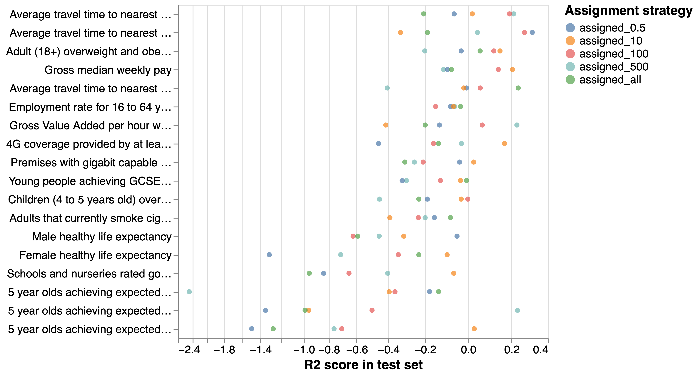
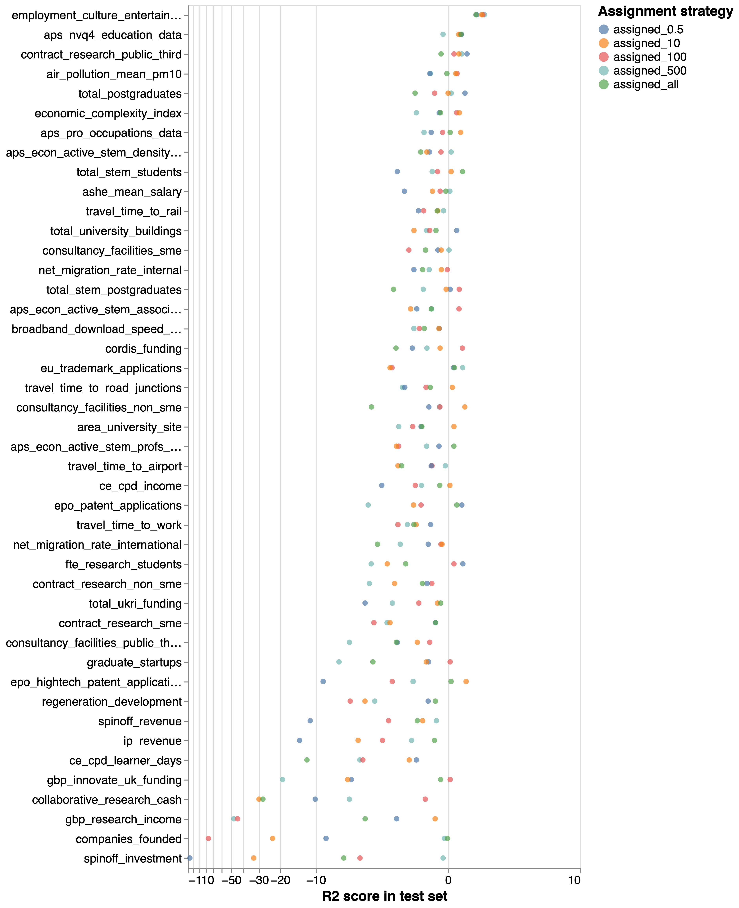
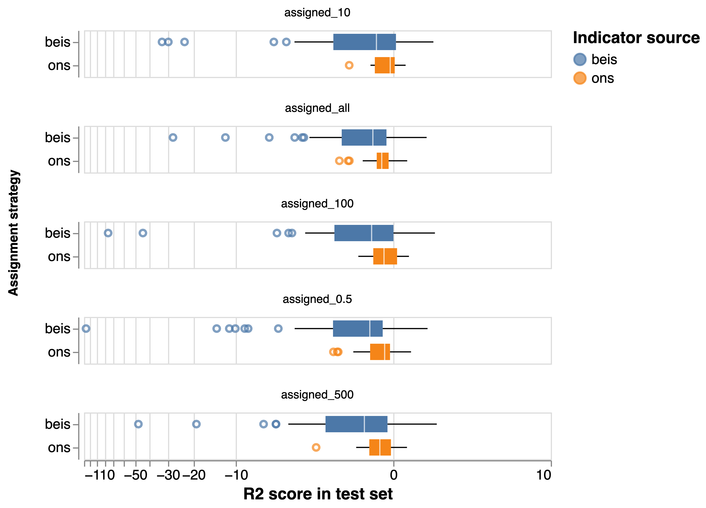
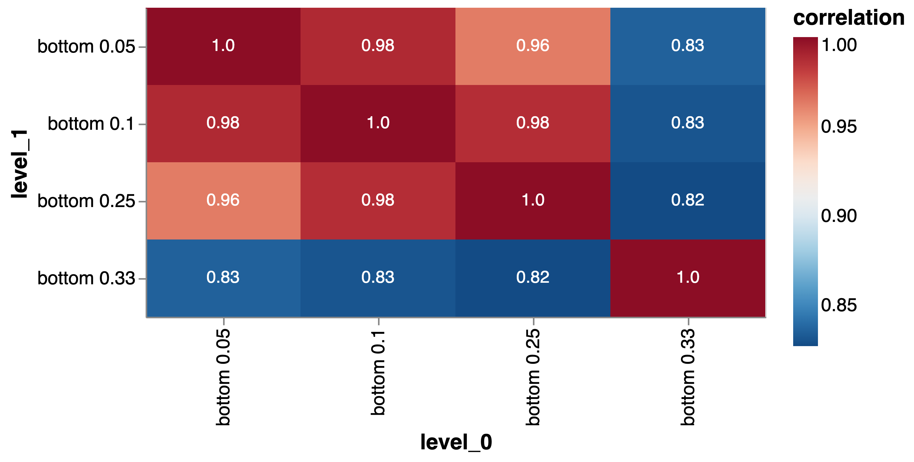

# Evaluation of reassignment outputs

Our updated pipeline can be implemented using a variety of tuning parameters, most notably the number of observations inside a 4-digit SIC code that are originally assigned to a cluster (text sector), subsequently informing the global sector reassignment procedure. As we noted before, there is not a strong theoretical rationale to choose an assignment parameter ex ante:

* Assigning fewer companies to a text sector reduces the risk of including edge cases that make the text sector more heterogeneous and noisier.
* At the same time, this reduces the number of observations that are used in the reassignment procedure, potentially making it less stable.
* Intermediate assignment strategies might balance the trade-off between the two situations above.

We  have designed a "consequential evaluation" strategy to compare the outputs of different assignment strategies and select one that can be used for downstream analysis based on its correlation with secondary indicators published by ONS and Nesta/BEIS for the launch of the UK Government's Levelling Up white paper. The basic (and pragmatic) idea informing this approach is that an assignment strategy that generates outputs which are more strongly associated to economically and socially meaningful features of local economies is preferrable. The fact that we want to, in a later stage of our analysis, compare the performance in those secondary indicators of clusters of locations based on their industrial profiles (which we estimate with our taxonomy) further motivates this approach: we would after all expect the version of the taxonomy which is more informative about secondary indicators to also generate a clustering solution more relevant for their analysis.

## Model features

Our model takes as its input a sectoral specialisation profile for UK local authorities based on the text sector outputs from an assignment strategy.[^1] This profile is an n-dimensional vector where n is the number of text sectors generated by an assignment procedure. The values of the vector capture a sector's location quotient (Balassa index) in the location. 

[^1]: We decided to use local authorities as the geographical unit of analysis versus functional economic geographies such as Travel to Work Areas because there are many more secondary indicators available at the local authority level.

## Model targets

Our goal is to predict economically and socially meaningful features of a local economy using its sectoral specialisation profile based on an implementation of the taxonomy (i.e. based on an assignment strategy parameter amongst which we want to choose). We have selected two sets of indicators to do this. They are:

1. Eighteen indicators about local economies in the UK released by ONS capturing various levelling up missions around health, education, infrastructure etc. Each of these indicators is available for a single period / year.[^2] 
2. Forty-four indicators about local innovation systems in the UK compiled by Nesta for a local innovation dashboard developed in collaboration with BEIS - these indicators are focused on research, innovation and economic features of those local authorities.[^3] We focus our analysis on the most recent year for which an indicator is available.

We have standardised all indicator values in order to enhance comparability between their error rates.

[^2]: see [here](https://www.ons.gov.uk/peoplepopulationandcommunity/wellbeing/articles/subnationalindicatorsexplorer/2022-01-06) for additional information about these indicators and their methodology.
[^3]: See [here](https://access-research-development-spatial-data.beis.gov.uk/) for additonal information about these indicators and their methodology.

## Modelling strategy

We use `GradientBoostingRegressor`, the gradient booster algorithm implemented in the python package scikit-learn. 

Gradient boosting is a popular approach for predictive analyses of tabular data (as is the case here). The algorithm builds ensembles of decision trees that split the data on those values of the features that minimise the prediction error in each group, making it possible to capture complex interdependencies between variables. One important feature of gradient boosting is that in subsequent iterations it upweighs those observations with high prediction error before, prioritising improvements in performance for those observations.

The algorithm can be tuned across multiple hyper-parameters including the error metric it seeks to minimise, the depth of the trees it builds and the minimum number of observations that a node in the tree needs to contain in order to be split, the maximum depth of the tree, the maximum number of features to consider etc. 

We identify the optimum set of parameters using grid search where the model is trained on a subset of the data and used to make predictions in a test set with three-fold cross-validation. We select, for each indicator and assignment strategy, the best performing estimator based on its the mean-squared error of its predictions, and evaluate its performance in a held-out set comprising 20% of all observations.

## Results

@fig:ons_predictive and @fig:beis_predictive show the fraction of variation explained by the best predictive model for each indicator (represented in the vertical axis and sorted by decreasing level of predictive performance) and assignment strategy (represented by the point of the colours). We use a symmetric logarithmic scale on the horizontal axis to reduce the impact of outliers on the chart.

{#fig:ons_predictive}

{#fig:beis_predictive}

We note a number of things:

1. The models perform badly for many indicators (with negative $R^2$). This should not come as a surprise: the dataset we are working with is very small (375 observations at most, one for every local authority when an indicator is available for all of them) and includes a number of health, education and infrastructure variables where we would only expect to find weak correlations with a location's sectoral composition.
2. Related to the point above, our goal with this analysis is not to predict a locations' performance in indicators based on secondary data, but to compare the performance of different versions of the taxonomy. A predictive analysis would for example have benefitted from the adoption of dimensionality reduction and clustering techniques to reduce the width of our feature set, which might lead to overfitting. We use some of those methods in section 4.
3. In the case of the ONS data, our predictive models perform better for economic and transport indicators, and worse for indicators of life expectancy and education.
4. For the BEIS data, perhaps unsurprisingly, the models perform best for an indicator capturing levels of employment in "employment, culture, entertainment and recreation" with an average $R^2$ of 0.8, and in indicators related to the composition of the workforce and its reliance on highly educated workers, which we might expect to see correlating with the sectors it specialises on. It performs worse for indicators related to knowledge exchange between university and industry and entrepreneurship, which are in some cases not sector-specific and for which we have less data (in many cases only capturing those local authorities where there is at least one higher-education institution).
5. It is hard to see substantial differences in the performance of different assignment strategies. To address this, we present the distribution of performance by assignment strategy and indicator source in @fig:boxplot, ranking assignment strategies vertically by their median performance. The figure shows that the two best-performing assignment strategies are `assigned_10`, where we assigned the ten most representative companies to each text cluster, and `assigned_all`, where we assigned all of them. Based on this result, we choose to use the outputs from the `assigned_10` strategy in downstream analysis.[^4]

{#fig:boxplot}

[^4]: One concern here is that our selection might be skewed by the very erratic worst-performing models. To avoid this, we also compare the model performance for different assignment strategies after removing indicators where *not a single model managed to explain variance in the outcome*, finding once again that the `assigned_10` strategy has the best median performance in the set followed by the `assigned_all` strategy.

## Impact of removing low similarity companies

Our text assignment strategy is based on a company's average similarity to other companies in its vicinity: we assign it to the text sector whose companies are, on average, closest to it. In addition to seeking to mitigate the risk that we end assigning companies to "bad" close matches, by setting matches with a closest similarity score below 0.6 to `None`, here we explore the impact on our outputs from removing the highest disparity (lowest similarity to closest match) companies in the data (focusing on the text assignment based on the `assigned_10` strategy).

In order to do this, we have removed from our text assignments organisations with similarity scores at the bottom of the distribution at progressively increasing thresholds (remove bottom 5%, bottom 10%, bottom 25%, bottom 33%). Having done this, we calculate the local specialisation profile for a location based on those assignments. @fig:spec_correlation shows the correlation coefficient between the specialisation profiles generated with different thresholds. We see that the specialisation profiles remain highly correlated even after we remove a third of the companies in the sample, suggesting that the inclusion of organisations with lower similarity scores is not substantially skewing our results. Given this, we keep all these companies for downstream analyses.

{#fig:spec_correlation}