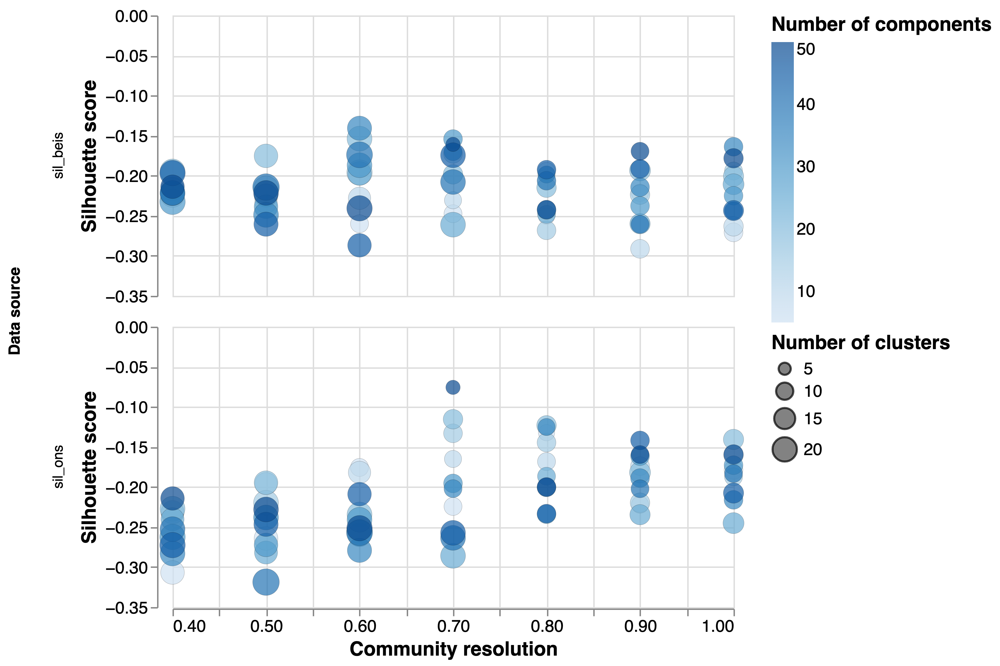
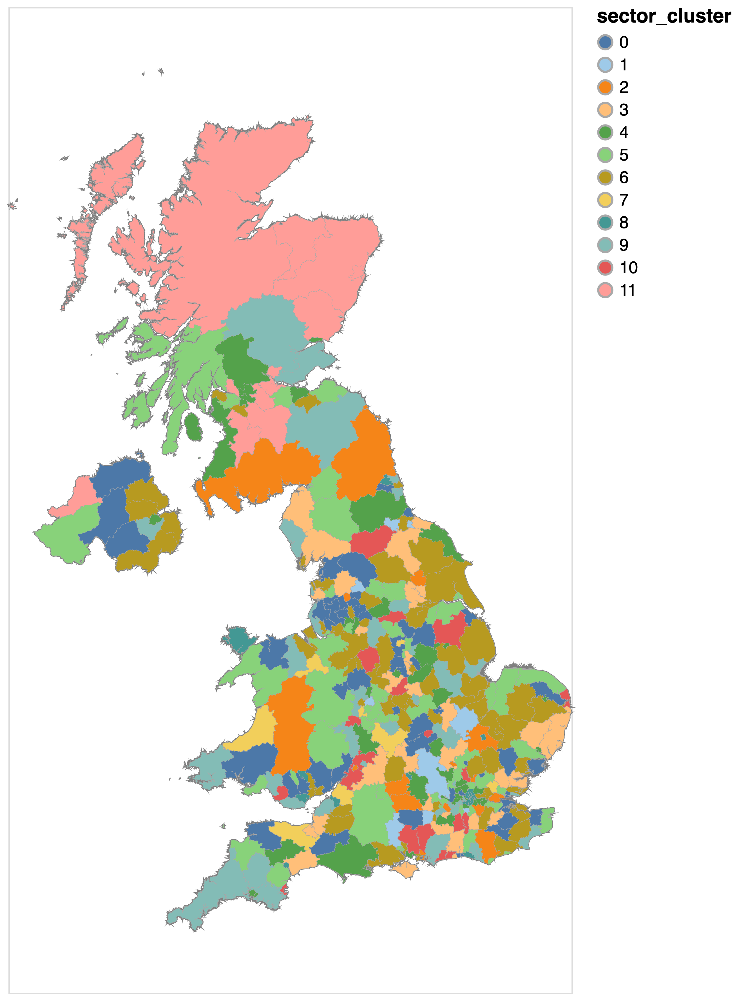
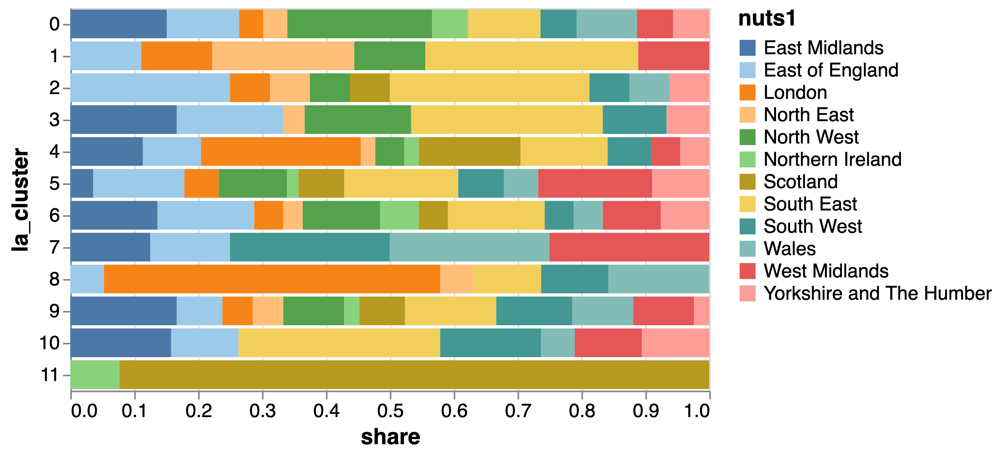
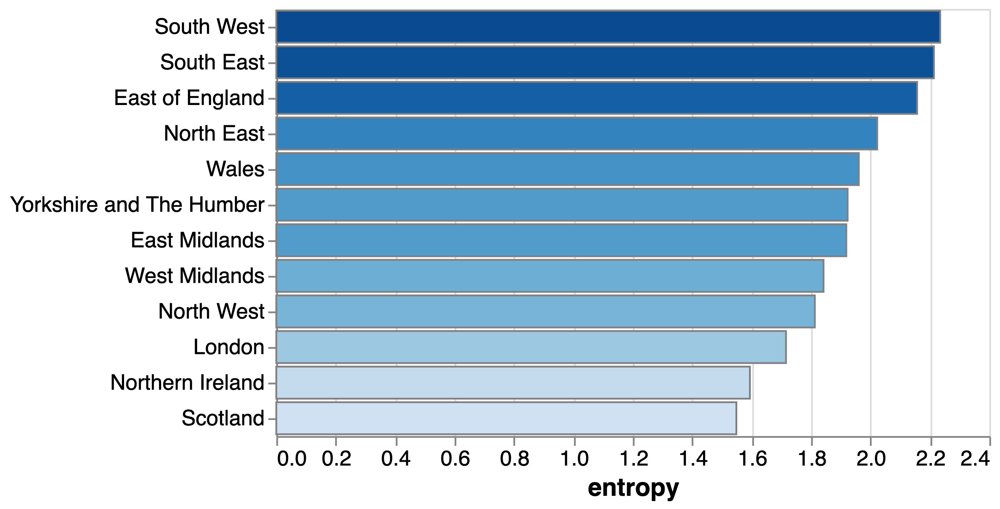
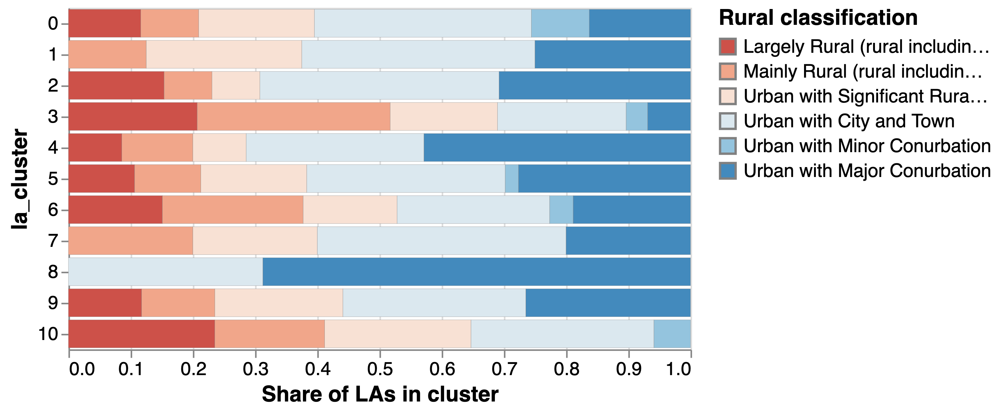
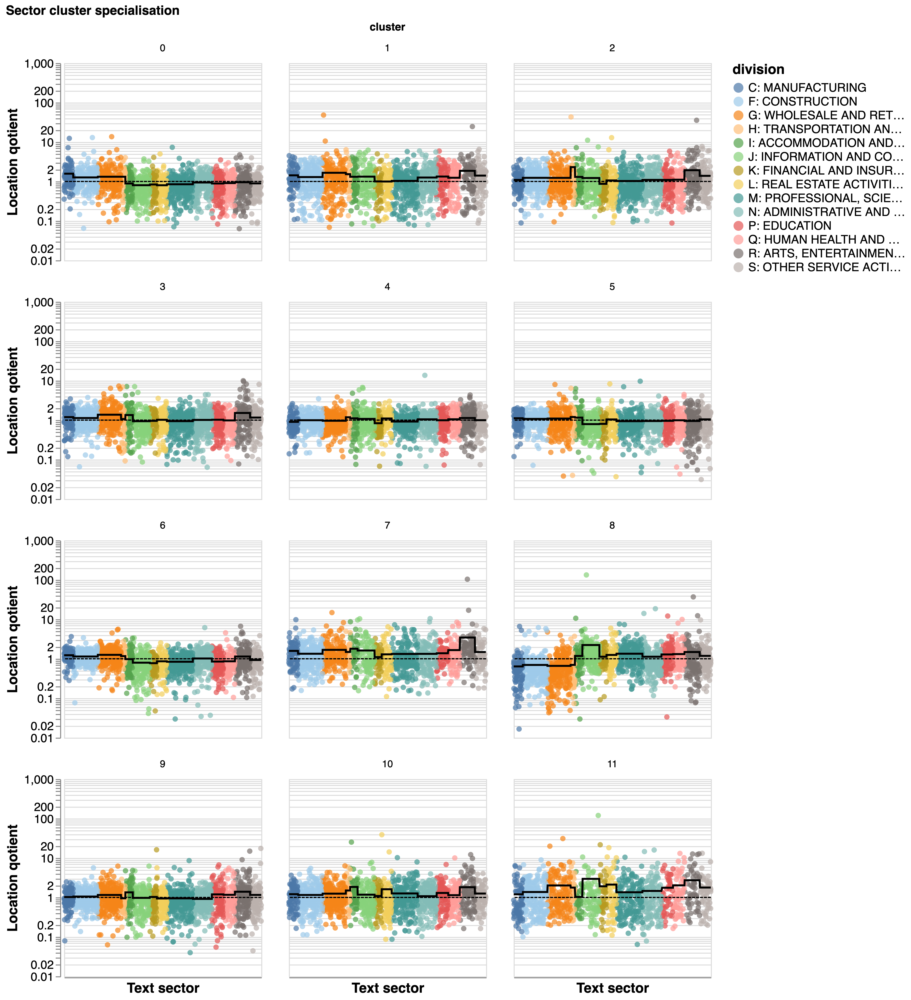
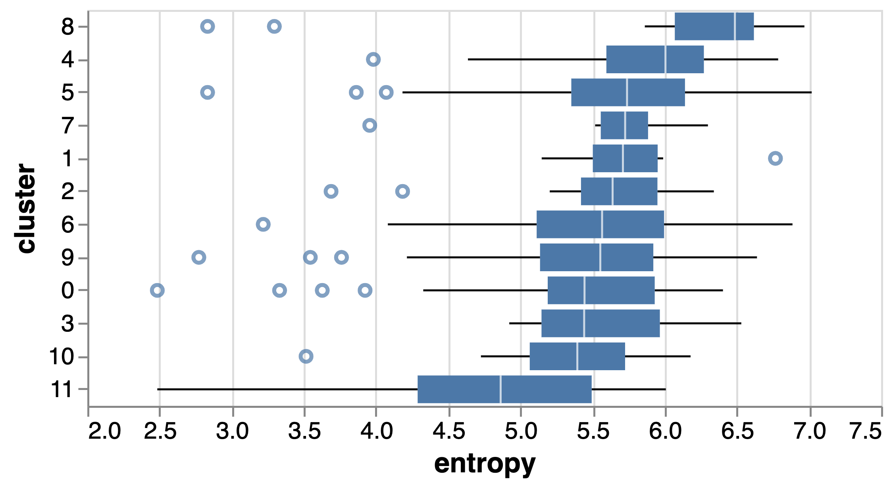

# An exploration of levelling up indicators through the lens of our bottom-up industrial taxonomy

In this section, we use the highest resolution layer of our industrial taxonomy to segment local authorities (local economies) into different clusters based on their specialisation profiles. Having done this, we study these clusters' geography, industrial composition and performance along a variety of secondary indicators that we already used in Section 3. Our goal is to establish whether our taxonomy can shed some light on economic and social differences between different part of the UK and potentially inform interventions to remove barriers to growth in specific locations. 

## Clustering strategy

We take the following steps to cluster local authorities into "sector specialisation clusters". 

1. We calculate the relative specialisation of all local authorities in the UK in the 2,156 text sectors obtained by our clustering pipeline following the `assigned_10` strategy that performed best in a predictive analysis of secondary benchmark data.
2. We apply two dimensionality-reduction steps to this very wide and potentially correlated and noisy dataset: first we use principal component analysis, and then UMAP (Uniform Manifold Approximation and Projection for Dimension Reduction). The output is a two dimensional projection of the data (see @fig:umap_plot) that we cluster.
3. We cluster the outputs of this dimensionality reduction exercise with an ensemble of clustering algorithms and clustering parameters including K-Means clusters, Affinity Propagation and Gaussian Mixtures implemented in the `scikit-learn` python package. This ensemble approach has the goal of reducing our reliance on particular clustering algorithms, cluster parametrizations and random runs of clustering algorithms. More specifically, we build a network where local authorities are nodes, and the weight of their connections capture the number of times that they are assigned to the same cluster by a clustering algorithm, parameter set and cluster run. 
4. We decompose the resulting network into communities of local authorities using the Louvain algorithm, a technique that optimises the modularity of a network partition i.e. the extent to which the identified communities are internally connected and externally disconnected.

The outputs of this complex pipeline are dependent on two important parameters - the number of components that we extract using principal component analysis, and the level of resolution at which we implement the community detection algorithm. Instead of selecting between these heuristically, we adopt a "consequential evaluation" strategy along the lines of what we did in section 3. This time we calculate, for each combination of parameters in our clustering pipeline, the silhouette score of the clustering outputs in the same benchmarking indicators that we introduced in Section 3 (REF). [^1] Put informally, this is equivalent to searching for the parameter set that generates a clustering of local authorities that maximises the similarities in those secondary indicators *inside a cluster* and the differences *between clusters*.  

[^1]: Silhouette scores capture the extent to which observations within a cluster are similar to each other and dissimilar from those in other clusters. In this case, we measure similarity / dissimilarity using vectors formed by two set of benchmarking indicators (ONS and BEIS) that we introduced in Section 3.

Figure @fig:benchmark_sil presents the outputs of this analysis for 70 pairs of principal component and community resolution parameters. 

{#fig:benchmark_sil}

In general the silhouette scores are low, indicating a high degree of overlap between sector clusters, which might have been expected given the challenges reported in the predictive analysis from section 3 and the fact our clustering is based on a different dataset.  We opt for the parameter combination yielding the highest silhouette score, where we extract 50 components from the high-dimensional sectoral specialisation profile and detect communities at a level of resolution of 0.7. This yields 12 "sector clusters" that are represented by the colours in the UMAP projection in @fig:umap.

{#fig:umap}

## Geography of Local authority text-sector clusters

We start by exploring the composition of the resulting sector specialisation clusters. @tbl:top_lads displays their top ten local authorities by number of companies, @fig:choropleth maps them, and @fig:nuts1_distr shows the distribution of NUTS1 regions (nations and regions) over clusters. 

|   Sector cluster | Top local authorities                                                                                                                                            |
|-----------------:|:-----------------------------------------------------------------------------------------------------------------------------------------------------------------|
|                0 | Bolton, Wigan, Medway, Maidstone, Brent, Braintree, Basingstoke and Deane, Rochdale, Oldham, Rotherham                                                           |
|                1 | Buckinghamshire, Sutton, Test Valley, Walsall, Huntingdonshire, Darlington, Hart, Middlesbrough, Pendle                                                          |
|                2 | Bromley, York, West Berkshire, South Cambridgeshire, Luton, Wealden, Thurrock, Vale of White Horse, Runnymede, Northumberland                                    |
|                3 | Stockport, Chelmsford, Wokingham, Central Bedfordshire, Waverley, Tonbridge and Malling, East Suffolk, Cherwell, Charnwood, Tandridge                            |
|                4 | Manchester, Glasgow City, City of Edinburgh, Barnet, Milton Keynes, Ealing, County Durham, Kensington and Chelsea, Dorset, Belfast                               |
|                5 | Birmingham, Leeds, Sheffield, Wiltshire, Cheshire West and Chester, Trafford, Bradford, Shropshire, Enfield, Coventry                                            |
|                6 | Cheshire East, Bournemouth, Christchurch and Poole, Nottingham, Bath and North East Somerset, Warrington, Harrogate, Newham, Colchester, Doncaster, West Suffolk |
|                7 | South Gloucestershire, Somerset West and Taunton, Dudley, Chesterfield, Brentwood, Wrexham, Stratford-on-Avon, Ceredigion                                        |
|                8 | Westminster, Camden, City of London, Islington, Hackney, Bristol, City of, Tower Hamlets, Brighton and Hove, Southwark, Cardiff                                  |
|                9 | Cornwall, Liverpool, Hammersmith and Fulham, Leicester, North Somerset, Elmbridge, Sefton, Wakefield, Richmond upon Thames, Sunderland                           |
|               10 | Northampton, Reigate and Banstead, Winchester, Barnsley, Welwyn Hatfield, Torbay, Mole Valley, Bridgend, North West Leicestershire, East Hampshire               |
|               11 | Aberdeen City, South Lanarkshire, North Lanarkshire, Highland, Falkirk, Aberdeenshire, West Dunbartonshire, East Ayrshire, Moray, Angus                          |
: Top local authorities by sector specialisation cluster {#tbl:top_lads}

{#fig:choropleth}

{#fig:nuts1_distr}

We see some geographical patterns in the emerging clusters: cluster 11 is almost completely comprised by Scottish local authorities, and cluster 8 by boroughs in London together with other cities with strong creative / digital industries such as Brighton and Hove, Bristol and Cardiff (as well as Oxford and Cambridge, not represented in the table). Cluster 1 has a stronger presence from local authorities in the North East, and Cluster 7 from the North West. Other clusters have representation scattered across the country. For example cluster 4 has large cities from across the UK, including Manchester, Glasgow City, Milton Keynes and Belfast, and cluster 5 includes Birmingham, Leeds and Sheffield.

This suggests that the industrial composition of the UK is rather mixed: neighbouring locations have, in some cases, very different industrial compositions, while local economies in far-away parts of the country are in some cases similar. Having said this, some NUTS1 regions / nations are more heterogeneous than others - we show this in @fig:sect_entropy, where we have calculated the entropy of the sector cluster distribution inside regions: South West, South East and East of England are more diverse in the sectoral composition of their local authorities, while London, Northern Ireland and Scotland are most homogeneous (here it is worth noting that this observation refers to the *diversity* of sectoral configurations inside a NUTS1 region, not to the diversity of the set of industries within those configurations - we consider that question below). 

{#fig:sect_entropy}

To which extent do our sector specialisation clusters reflect differences in the rural / urban characteristics of local authorities? We have used the 2011 Local Authority Rural Urban classification of local authorities produced by the Department for Environment, Food and Rural Affairs (DEFRA) to label English local authorities with a category and visualise the distribution of categories over clusters in @fig:rural_distr.[^2] This shows, unsurprisingly, that Cluster 8, which mostly included London boroughs, is predominantly urban while clusters 3 and 10 are mostly rural. Cluster 11 is excluded from this chart because it does not include any English local authorities, for which the rural - urban classification is available.

{#fig:rural_distr}

[^2]:https://www.gov.uk/government/statistics/2011-rural-urban-classification-of-local-authority-and-other-higher-level-geographies-for-statistical-purposes

## Sectoral differences

We have used the sectoral specialisation profile of UK local authorities to cluster them into sector specialisation clusters - but what are their sectoral differences exactly? 

@fig:spec_profile shows the average location quotient for each text sector in a specialisation cluster (dots) colored by the division that their 4-digit SIC code belongs to. The black line represents the average location quotient in the cluster for all text sectors in a SIC division. 

{#fig:spec_profile}

We find that cluster 8, which comprised London boroughs and creative/digital local authorities, is under-specialised in manufacturing, construction and retail sectors, and over-specialised in knowledge intensive sectors such as information and communication activities, professional activities and education. By contrast, cluster 0, which includes local authorities such as Bolton, Wigan or Medway, specialises in manufacturing and construction. Some of the clusters with a predominance of rural local authorities (e.g. cluster 6, cluster 10) tend to specialise in activities related to Arts, Entertainment and Recreation and Accommodation and Food, perhaps reflecting their reliance on tourism. 

Similarities between clusters at a high levels of aggregation (e.g. SIC divisions) could mask differences in highly detailed text sectors. This is illustrated by @tbl:sector_examples, where we show the top five text sectors in different sector specialisation clusters with a focus on Division I of the SIC taxonomy ("Information and Communication activities") and a subset of the sectors clusters we have considered. 

We see important differences between clusters: Cluster 8, comprising knowledge intensive boroughs in London and other creative/digital local authorities shows strong levels of specialisation in broadcasting, media (including financial news) and content production text sectors. On the other hand, cluster 0, mostly comprising rural and city and town local authorities that specialise in manufacturing and constraction, tends to focus on information text sectors related to community and SME support. Cluster 4, including Manchester, Glasgow and Edinburgh, specialises music-related sectors. Cluster 5, with Birmingham, Leeds and Sheffield, is more focused on book publishing.

|   Sector cluster | Example sectors                                                                                                                                                                                                                                                                                 |
|-------------------------:|:------------------------------------------------------------------------------------------------------------------------------------------------------------------------------------------------------------------------------------------------------------------------------------------------|
|                0 | community sector, information support, voluntary sector, children adults, patients world expertise provide, repair service, staff customers, small businesses, cloud solutions digital media, high level service, systems services, home automation, dedicated providing                        |
|                3 | boutique publishing, editorial director, uk based, agents publishers, networking opportunities music company, great music, producers artists, artists music, production music books available, books provide, publishing industry, books make, book publisher                                   |
|                4 | bandcamp s, artist buy bandcamp, artist fan, artists make lot, artists matter high quality, s new, award winning, uk based, boutique publishing london recording, recording studios, academy music, artist fan, north london                                                                    |
|                5 | community sector, information support, voluntary sector, children adults, patients world books provide, book publisher, books journals, based publishing, innovative high quality uk s, advice scotland, community sector, voluntary community sector, information support                      |
|                8 | uk film, films corporate, directors producers, theatre young, production management market news, financial markets, news opinion, media company, company provides production company, television production company, based film production, film production, independent television production  |
|               11 | citizens advice scotland, citizens advice bureau, advice scotland cas, citizens advice, advice scotland staff books available, books provide, publishing industry, books make, book publisher management solutions, company providing, software product, services products, providing solutions |
: High specialisation sectors in Division I (Information and Communication) for selected clusters {#tbl:sector_examples}
                                                                 
We conclude our analysis of the sectoral composition of clusters by comparing the diversification of local economies different sector clusters: In order to do this, we calculate the entropy of the sector distribution in each LAD, capturing the extent to which this distribution is even (in which case entropy will be high) or concentrated in a few sectors (in which case entropy) will be low. @fig:sector_entropy shows that sector clusters comprised of urban and more knowledge intensive local authorities (cluster 8, 4 and 5) tend to contain more diversified local economies while rural clusters such as 11, 10 and 3 tend to be less diversified.

{#fig:sector_entropy}

## Differences in benchmark indicators

Having analysed the geography and sectoral composition / diversity of our sector specialisation clusters, we move to analyse their association with other important measures of social and economic outcomes compiled by ONS and Nesta/BEIS. 

We seek to account for variability in the values of benchmark indicators *inside* sector clusters by regressing each (standardised) benchmark indicator on a binary variable indicating whether a local authority belongs to a sector cluster or not, controlling for a local authority's population size based on the Annual Population Survey (APS) and logged, and clustering errors on a local authority's NUTS1 region. We present the results in @fig:ons_bench and @fig:beis_bench, only including those regression results whose confidence intervals do not span zero (i.e., we focus on results that are statistically different from zero): these are results where a cluster's average performance is significantly different from all other clusters. 

{#fig:ons_bench}

When looking at the ONS benchmarking indicators, the most visible result is that cluster 8 (the sector cluster comprising London and other creative and digital firms) outperforms other clusters in a variety of indicators such as gross median weekly pay, outstanding schools and nurseries, good school results in maths, 4G coverage and low prevalence of obesity. It also has, on average, shorter travelling times potentially reflecting a higher population density and stronger transport infrastructure. On a similar vein, cluster 4, which included large cities in other parts of the country, also performs well in its gross median weekly pay and gross GVA per worker. By comparison, cluster 0, which included a number of local authorities specialising in manufacturing and construction mostly outside of the South East and London seem to perform worse economically and socially, with below average salaries, productivity, higher rates of obesity in adults and children, and worse educational outcomes. 

{#fig:beis_bench}

The BEIS benchmark indicators are more focused on the economic, research and innovation strengths of a location. In line with the ONS results, we find that cluster 8 significantly outperforms other clusters in many of these indicators. In particular, LADs in this cluster tend to have more educated workforces in professional occupations, their economies are more complex and diversified, they attract more international migrants and perform well in a variety of research and knowledge-exchange related indicators. The situation in cluster 0 and cluster 1, which interestingly includes several local authorities in the South East, is the opposite, with below-average performance in a variety of economic and research related indicators and less educated workforces. We note that cluster 4, which includes a number of large cities mostly outside of London and the South East is not significantly higher than other clusters despite its strong economic performance in the ONS indicators.

We conclude by noting that that the analysis we have presented above is purely correlational: we are comparing the performance in various indicators across clusters without drawing causal interpretations from the differences that we identify. In some cases, the direction of causality might go from indicators to clusters (poor transport infrastructure hinders the development of specific industries), or be caused by a third factor (low levels of education are linked to high obesity rates and a prevalence of jobs in low-productivity services industries). Having said this, our analysis suggests that the industrial composition of a location is an important element of the system system that shapes its economic and social outcomes, and that it should be taken into account during the design and implementation of levelling up policies aimed at changing those outcomes.

